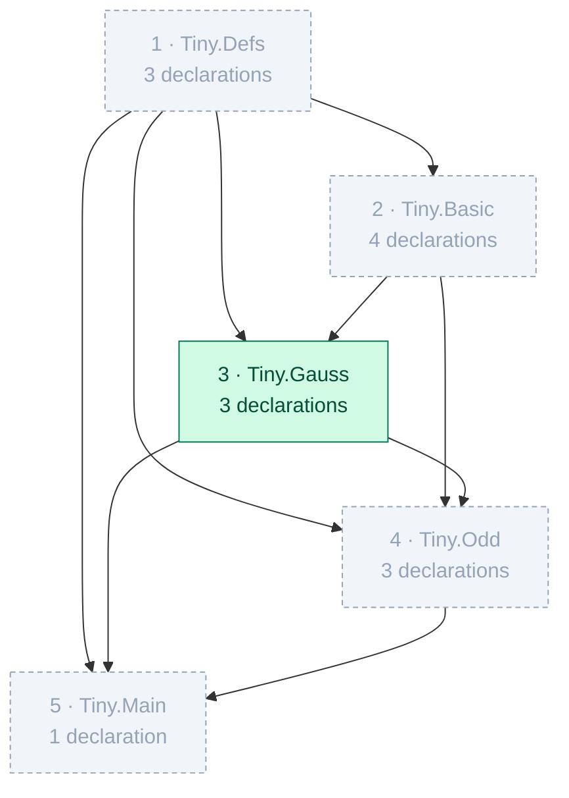

# Map of the units

An arrow runs from a unit to a unit that uses it. Grey: not read yet.

```mermaid
flowchart TD
  u1["1 · Tiny.Defs<br/>3 declarations"]:::unread
  u2["2 · Tiny.Basic<br/>4 declarations"]:::unread
  u3["3 · Tiny.Gauss<br/>3 declarations"]:::note
  u4["4 · Tiny.Odd<br/>3 declarations"]:::unread
  u5["5 · Tiny.Main<br/>1 declaration"]:::unread
  u1 --> u2
  u1 --> u3
  u2 --> u3
  u1 --> u4
  u2 --> u4
  u3 --> u4
  u1 --> u5
  u3 --> u5
  u4 --> u5
  classDef note fill:#d1fae5,stroke:#047857,color:#064e3b
  classDef proofs fill:#fef3c7,stroke:#b45309,color:#78350f
  classDef dossier fill:#e0e7ff,stroke:#3730a3,color:#1e1b4b
  classDef unread fill:#f1f5f9,stroke:#94a3b8,color:#94a3b8,stroke-dasharray: 4 3
```

Green: note and structured proofs. Amber: structured proofs, checked. Blue: dossier, not yet checked.
